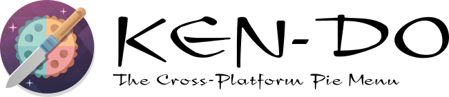

<!--
SPDX-FileCopyrightText: Simon Schneegans <code@simonschneegans.de>
SPDX-License-Identifier: CC-BY-4.0
-->

<p align="center">
  
</p>


_:construction: This project is currently in a very early stage of development. For now, I use this repository mainly for testing things. You can read regular updates on the project on [my Ko-fi page](https://ko-fi.com/schneegans)._

**Ken-Do** will be a pie menu for the desktop.
It will be highly customizable and will allow you to create your own menus and actions.
For instance, you can use it to control your music player, to open your favorite websites or to simulate shortcuts.
It will be available for Windows, Linux and maybe macOS.

# The Vision


I am the developer of [Fly-Pie](https://github.com/Schneegans/Fly-Pie/), which is a similar project but limited to the GNOME desktop.
I have been working on Fly-Pie for more than 3 years now and I am very happy with the result.
However, I have always wanted to create a similar application for the desktop in general.
This is why I started this project.

Ken-Do will be very similar to Fly-Pie in terms of interaction and appearance.
However, I plan to make application-dependent menus a first-class citizen.
So the menu will be able to show different actions depending on the currently focused application.

# The Prototype

This project is in a very early stage of development.
I am currently working on a prototype which allows me to test some core concepts.
It currently demonstrates the following core features:

| Key Feature | Windows | Linux (X11) | Linux (Wayland) |
|-------------|---------|-------------|-----------------|
| Opening a transparent top-level window | :heavy_check_mark: | :heavy_check_mark: | :heavy_check_mark: |
| Listening to global hotkeys | :heavy_check_mark: | :heavy_check_mark: | :heavy_minus_sign: (5) |
| Drawing something at the mouse position | :heavy_check_mark: | :heavy_check_mark: | :heavy_minus_sign: (6) |
| Get the name and class of the currently focused application window | :heavy_check_mark: (1) | :heavy_check_mark: (3) | :heavy_minus_sign: (7) |
| Simulating key presses | :heavy_check_mark: (2) | :heavy_check_mark: (4) | :heavy_minus_sign: (8) |

1. Requires a native C++ node module which uses [`GetForegroundWindow()`](https://learn.microsoft.com/en-us/windows/win32/api/winuser/nf-winuser-getforegroundwindow) from the Windows API.
1. Uses a `powershell` script to simulate key presses. This is not ideal, as it fails to simulate the <kbd>Super</kbd> key. In future, we will require a native module using [`SendInput()`](https://learn.microsoft.com/de-de/windows/win32/api/winuser/nf-winuser-sendinput) from the Windows API.
1. Requires a native C++ node module which uses XLib methods.
1. Uses a `xdotool` script to simulate key presses.
1. For now, this only works on GNOME using an [extension](https://github.com/ken-do-menu/gnome-shell-integration). However, there is the [global shortcuts portal](https://flatpak.github.io/xdg-desktop-portal/#gdbus-org.freedesktop.portal.GlobalShortcuts) which may solve this for all Wayland compositors.
1. This is more difficult than it appears. On Wayland, clients seem to get the current mouse pointer position only when the user moves the pointer over the window for the first time. So if the mouse pointer is stationary while the window opens, the window will not receive any mouse input events. I made this work on GNOME by using an [extension]((https://github.com/ken-do-menu/gnome-shell-integration)) which reports the current mouse position to the client over DBus. Maybe something similar can be done for other compositors.
1. For now, this also only works on GNOME using the [extension](https://github.com/ken-do-menu/gnome-shell-integration). However, there is a request for a [corresponding portal](https://github.com/flatpak/xdg-desktop-portal/issues/304) which may solve this for all Wayland compositors.
1. For now, this also only works on GNOME using the [extension](https://github.com/ken-do-menu/gnome-shell-integration). However, there is the [remote desktop portal](https://flatpak.github.io/xdg-desktop-portal/#gdbus-org.freedesktop.portal.RemoteDesktop) which may solve this for all Wayland compositors.

## Building the Prototype

Before you start, you will have to install `node` and `npm`.
You will also need `node-gyp` for building the native backends:

```
npm install -g node-gyp
```

Additionally, you will need a C++ toolchain.
On Linux, this will be installed already.
On Windows, you can install either Visual Studio or run this:


```
npm install -g windows-build-tools
```

On GNOME under Wayland you will also need to install the [adapter extension](https://github.com/ken-do-menu/gnome-shell-integration).
Once these dependencies are installed, only these two commands are required:

```
npm install
npm start
```

Once this is running, you can press <kbd>Ctrl</kbd>+<kbd>Shift</kbd>+<kbd>K</kbd> to open the test window.

To create a distributable zip file, just run `npm run make`.

