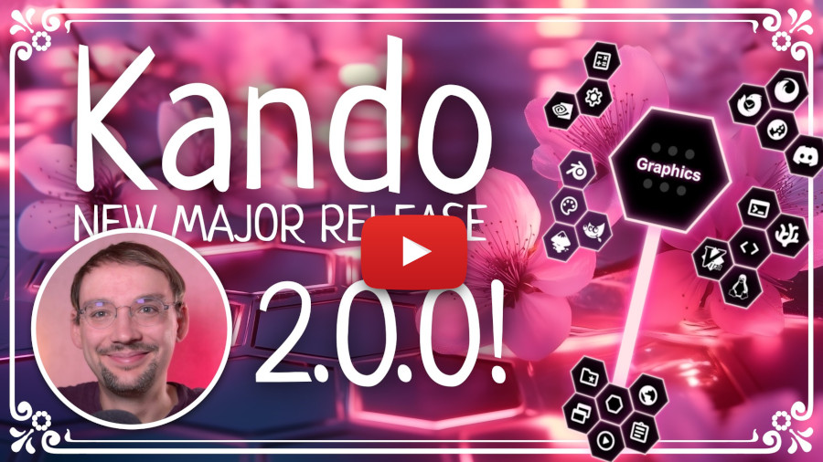

<!--
SPDX-FileCopyrightText: Simon Schneegans <code@simonschneegans.de>
SPDX-License-Identifier: CC-BY-4.0
-->

  

**Kando** is a highly customizable pie menu for the desktop which allows you to create your own menus and actions.
For instance, you can use it to control your music player, to open your favorite websites, or to simulate shortcuts.
It is available for Windows, Linux and macOS.

# The Vision

I am the developer of [Fly-Pie](https://github.com/Schneegans/Fly-Pie/), which is a similar project but limited to the GNOME desktop.
I have been working on Fly-Pie for more than 3 years now and I am very happy with the result.
However, I have always wanted to create a similar application for the desktop in general.
This is why I started this project.

  

**Kando** is very similar to Fly-Pie in terms of interaction and appearance.
At the same time, there are some major differences.
You can read more in this [blog post](https://ko-fi.com/post/Introducing-Ken-Do-L3L7L0FQ2)!

# Platform Support

Implementing a menu like Kando in a cross-platform manner is not exactly easy.
Things like getting the mouse position before opening a window, simulating key presses, or getting the name of the currently focused application window has to be implemented differently on each platform.

For now, I have tested Kando on the following platforms:

Tested Environment | Status | Notes
:-- | :---: | ---
 Windows | :heavy_check_mark: | Tested on Windows 11.
 macOS | :heavy_check_mark: | Tested on macOS 11.
 GNOME / X11 | :heavy_check_mark: |
 GNOME / Wayland | :heavy_check_mark: | Requires [adapter GNOME Shell extension](https://github.com/kando-menu/gnome-shell-integration) which provides a DBus interface for Kando to communicate with.
 KDE / X11 | :heavy_check_mark: |
 KDE / Wayland | :heavy_check_mark: | Uses the [KWin Scripting API](https://techbase.kde.org/Development/Tutorials/KWin/Scripting) and the [Remote-Desktop Portal](https://flatpak.github.io/xdg-desktop-portal/#gdbus-org.freedesktop.portal.RemoteDesktop) to implement the required functionality. It works both on Plasma 5 and Plasma 6.
 Hyprland | :heavy_check_mark: | Uses some [wlroots Wayland protocols](src/main/backends/linux/wlroots/native/protocols), the `hyprctl` command line tool and the [Hyprland Global Shortcuts](src/main/backends/linux/hyprland/native/protocols/hyprland-global-shortcuts-v1.xml) protocol to implement the required functionality.
 XFCE | :heavy_check_mark: |
 MATE | :heavy_check_mark: |
 Budgie | :heavy_check_mark: |
 Cinnamon | :heavy_check_mark: |
 LXQt | :heavy_check_mark: |
 LXDE | :heavy_check_mark: | Requires a compositor for the transparency to work.
 Openbox | :heavy_check_mark: | Requires a compositor for the transparency to work.
 i3 | :heavy_check_mark: | Requires a compositor for the transparency to work.

# :package: Installation

You can either [:arrow_down: download a pre-built package](https://github.com/kando-menu/kando/releases) from the releases page or [:rocket: compile Kando yourself](docs/installing.md).
With a pre-built package, you can just run the executable; no installation is required.

> [!IMPORTANT]
> If you are using GNOME under Wayland, you will also need to install the [:shell: adapter extension](https://github.com/kando-menu/gnome-shell-integration)!

Manual compilation is only required if you want to test the latest development version of the prototype or if you want to contribute to the project.

# :rocket: Getting Started

For now, the prototype only comes with an example menu which does not do anything useful.
However, if you want to get your hands dirty, you can already **create custom menus and actions by editing the config files**!
This way, the prototype can do something useful already.
You can read more about this in the [:memo: documentation](docs/configuring.md).

# :revolving_hearts: I want to contribute!

That's great!
If you like the idea of Kando, you can help in many ways:
* **Discuss the idea!** Tell me what you think about Kando and what features you would like to see. You can do this by [opening a discussion](https://github.com/kando-menu/kando/discussions) or by joining the [Discord server](https://discord.gg/hZwbVSDkhy).
* **Spread the word!** Tell your friends about Kando and share the project on social media.
* **Contribute code!** If you are a developer, you can help me with the implementation. I have never worked with Electron before, so I'm sure there is a lot of room for improvement. Please read the [contributing guidelines](docs/contributing.md) for more information!

While direct contributions are the most awesome way to support the development, donations will encourage me to invest my spare time for developing free and open-source software.

**These awesome people have already donated to the development of my open-source projects:**

<a href="https://schneegans.github.io/sponsors/">
  <picture>
    <source media="(prefers-color-scheme: dark)" srcset="https://schneegans.github.io/sponsors/sponsors_dark_small.svg">
    
  </picture>
</a>

## Credits

This README uses icons from [Simple Icons](https://simpleicons.org/).

