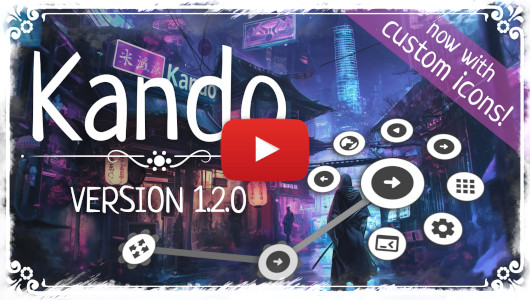

<!--
SPDX-FileCopyrightText: Simon Schneegans <code@simonschneegans.de>
SPDX-License-Identifier: CC-BY-4.0

Added      - for new features.
Changed    - for changes in existing functionality.
Deprecated - for soon-to-be removed features.
Removed    - for now removed features.
Fixed      - for any bug fixes.
Security   - in case of vulnerabilities.
-->

</img>

# Changelog of Kando

Kando uses [semantic versioning](https://semver.org).
This changelog follows the rules of [Keep a Changelog](http://keepachangelog.com/).

## [unreleased]

**Release Date:** TBD

### :bug: Fixed

- An issue which caused the center text to not hide properly under certain circumstances.
- An issue which made menus not appear at the mouse pointer when cycling through menus with the same shortcut.
- An issue which made Kando not respond to shortcuts after pressing the right mouse button twice in fast succession on Windows.
- Discovery of installed applications and icons when running on Linux inside a Flatpak container.
- A crash on Linux when an installed application had no `Name` entry in its `.desktop` file. Thanks to [@netizen-ais](https://github.com/netizen-ais) for the fix!
- Opening files and directories on Linux via an open-file action when their path contained spaces.

## [Kando 2.1.0](https://github.com/kando-menu/kando/releases/tag/v2.1.0)

**Release Date:** 2025-10-19

<a href="https://www.youtube.com/watch?v=wNNS7vrur3M">
</img>
</a>

### :tada: Added

- **An application picker for the run-command item type!** This allows you to select an application from apps installed on your system. It will automatically fill in the command to run the application, the name, and the icon.
- **Drag-and-Drop item creation!** You can now drag and drop things from your desktop or file manager into the menu editor to create new menu items. This works for:
  - Applications
  - Executables
  - Other files and directories
  - URLs
- **A System-Icons theme for Linux!** This allows you to use the system icons of your desktop environment as icons for menu items. They will change when you switch your icon theme! This is still somewhat experimental, but it should work on most desktop environments. Feel free to test it and report any issues you encounter!
- **A System-Icons theme for Windows and macOS!** On these operating systems, the theme contains the icons of apps installed on your system. This is also a bit experimental, please report any issues you encounter!
- **Visualization of the selection wedges!** Menu themes can now draw the circle segments belonging to the menu items as well as separator lines between them. The Neon Lights theme and the Default theme have been updated to use this feature.
- **Circle wrapping for the center text!** The center text is now wrapped in a circle instead of a rectangle. This makes it look better and allows longer texts to be displayed without clipping.
- **Automatic font-size reduction for the center text!** If the center text is too long to fit into the circle, it will now be automatically reduced in size so it fits.
- **Backup of the settings on version upgrades!** If you upgrade Kando to a new version, the old application settings and menu configurations will be automatically saved to a backup file. This allows you to restore them if something goes wrong during the upgrade. The backup files are stored in a `backup` directory next to the `config.json` and `menus.json` files.
- A few Kando logo variants in the built-in Kando icon theme.
- Caching of the icon themes to speed up the loading of the menu editor.
- Many translation updates: **Thanks to all the contributors!**

### :wrench: Changed

- The verification of the settings files. `config.json` and `menus.json` are now properly verified against a schema. Before, no type checks where performed which could lead to issues. Now, if they are not valid, Kando will refuse to start and print an error message. This is a first step towards importing, exporting, and sharing menu files with the community. I hope that your settings files are all valid, but if you encounter any issues, please report them!
- The icon in the top left corner of the settings dialog. It is now a colorful Kando icon instead of a gray one.
- Improved the readability of the source code by using `type` and `interface` in a more consistent manner. Thanks to [@LitoMore](https://github.com/LitoMore) for working on this!
- Improved the consistency of the source code by using more ESLint rules. Thanks to [@LitoMore](https://github.com/LitoMore) for this as well!
- Updated many other dependencies to their latest versions. Feel free to report any issues you encounter!

### :bug: Fixed

- Rendering of SVG icons which contain CSS styles. If multiple SVG icons with the same CSS classes were used in the same menu, the styles clashed resulting in wrong colors.
- Kando will not look for `systemd-run` on Windows and macOS anymore which removes a warning printed during startup.
- A bug which prevented the settings to be shown when a second instance of Kando was started on macOS.
- Added an option to turn off hardware acceleration to fix a bug that sometimes caused the window to lose its transparency (seen only with NVIDIA GPUs). Thanks to [@yar2000T](https://github.com/yar2000T) for this contribution!
- The varying width of the sidebar in the theme-selection dialog. The sidebar does not change width anymore when switching between the different themes with many accent colors. Thanks to [@kmqwerty](https://github.com/kmqwerty) for this contribution!
- Unresponsive Dev-Tools on Windows. The Dev-Tools now open in a separate window instead of being initially docked. You either have to manually dock the Dev-Tools or move them to another screen. Else the menu will block the input.
- Custom fonts in the settings dialog and in the menu. If you used a custom font in your system, this was not respected everywhere in Kando. Now, all widgets should use your custom font. Some menu themes may override this, but the default themes should all use the system font.
- An issue which caused menu items in the menu editor to be selected when the user clicked somewhere and then dragged the mouse over the item.  Thanks to [@AluctuatioAetern](https://github.com/AluctuatioAetern) for this contribution!
- A bug which made it impossible to change the path of an open-file item manually.
- A bug which made it possible to select items with key-up events even if turbo-mode was disabled.
- A bug which caused Kando to freeze when attempting to open a directory via a menu item on some Linux systems.

## [Kando 2.0.0](https://github.com/kando-menu/kando/releases/tag/v2.0.0)

**Release Date:** 2025-07-16

<a href="https://www.youtube.com/watch?v=ESf0D3hQE9g">
</img>
</a>

Beware that this major release adds some **[BREAKING]** changes.
They are marked with a **:collision:** emoji below.

### :tada: Added

- **A completely rewritten settings dialog!** The settings dialog is now a separate window and has a new design. This significantly improves the user experience and adds several new possibilities:
  - **A new introduction dialog:** This is shown the first time you open the settings dialog. It provides a quick overview of how to use Kando.
  - **A general-settings dialog:** This exposes all the settings which were previously only available in the `config.json` file.
  - **Support for undo/redo:** You can now undo and redo changes in the menu editor. This is done using the <kbd>Ctrl</kbd>+<kbd>Z</kbd> and <kbd>Ctrl</kbd>+<kbd>Y</kbd> shortcuts or with the corresponding buttons in the toolbar.
  - **Menu Collections:** You can now assign tags to your menus and group them by tags. This allows you to organize your menus in a structured way.
  - **Menus search:** You can now filter your menus by name!
  - **Reordering menus:** You can now reorder your menus by dragging and dropping them in the settings dialog.
  - **Direct drag-and-drop of menu items to other menus:** You can now drag and drop menu items from one menu to another in the settings dialog.
  - **New default icons for the menu-item types:** All menu-item types now have some custom-made icons.
  - **A file picker for the open-file item type:** This allows you to select files and directories using a file picker instead of typing the path manually.
  - **Support for dark and light mode in the settings dialog:** The settings dialog now adapts to your system's color mode.
- **An option to choose what happens if the same shortcut is pressed while a menu is open!** You can now choose...
  - ...to do nothing. This is the default behavior.
  - ...to close the menu again. This has been requested many times!
  - ...to cycle through the menus which are assigned to the shortcut and would be matching to the current context. This is useful if you have multiple menus assigned to the same shortcut and want to switch between them quickly! There are two variants here: In one variant, Kando will remember the last menu which was opened and show this again when the shortcut is pressed later. In the other variant, Kando will always show the first menu which matches the shortcut.
  
  Thanks to [@jonthemonke](https://github.com/jonthemonke) for contributing to this feature!
- **Support for deep links!** You can now use the `kando://` protocol to open Kando menus from other applications. This supports all command line parameters. For instance, `kando://menu?name=<menu-name>` will open the menu with the given name. Or `kando://settings` will open the settings dialog. On Linux, this only works if Kando has been properly installed with a `.desktop` file. Thanks to [@LitoMore](https://github.com/LitoMore) for this contribution!
- **An option to keep the active application focused!** If enabled, the menu will not receive keyboard input focus when opened. This disables Turbo Mode, but it may be useful if you require that other applications remain focused while the menu is open. This is somewhat experimental - please report any issues you encounter! You can enable this in the settings dialog under "Menu Behavior".
- **Experimental support arm64 on Windows!** There is now an experimental arm64 build for Windows. Please test it and report any issues you encounter!
- **A new menu item type: Open Settings!** This allows you to open the Kando settings directly from a menu item. Thanks to [@jonthemonke](https://github.com/jonthemonke) for this contribution!
- **A hotkey for opening the settings dialog** when a menu is open. On macOS, this is <kbd>Command</kbd>+<kbd>,</kbd>. On Windows and Linux, it is <kbd>Ctrl</kbd>+<kbd>,</kbd>. Thanks to [@jonthemonke](https://github.com/jonthemonke) for this contribution!
- **A default sound theme!** You can enable it in the general settings.
- **Support for the `"currentColor"` SVG attribute!** If an SVG icon of your icon theme uses the `currentColor` attribute for an element, it will be recolored by the menu theme and use the same color as the built-in icons. Read more in the [documentation](https://kando.menu/icon-themes/#make-icon-colors-adaptive).
- **Support for the global-shortcuts portal on KDE Wayland!** This means that when you edit the shortcut ID of one of your menus, a dialog will pop up asking you to select a shortcut. This will make it easier to set up shortcuts for your menus on KDE Wayland.
- **Support for multiple pointing devices on GNOME Wayland!** Thanks to a change in the [GNOME Shell integration extension](https://github.com/kando-menu/gnome-shell-integration), Kando now supports multiple pointing devices on GNOME Wayland. This means that the menu will now open at the position of the last used pointing device. This is useful if you are using a stylus in addition to a mouse or touchpad. Thanks to [@hhhhhhh2019](https://github.com/hhhhhhh2019) for the contribution!
- **The possibility to run commands in a clean environment on Linux** systems which have `systemd-run` installed. On these systems, you will see a new checkbox in the command item type configuration. Checking this box may fix some issues with applications which do not work properly when launched from Kando.
- **The possibility to disable launching a command in detached mode.** Detached mode had been introduced in 1.6.0 but there seem to be some applications which do not work properly when launched in detached mode. You can disable this with a checkbox in the configuration of the run-command item type.
- **A new backend for Niri on Linux!** With this, Kando now also works on [Niri](https://github.com/YaLTeR/niri), a Wayland compositor which is based on Smithay but supports wlroots protocols such as the ones used for the backend's implementation. Thanks to [@make-42](https://github.com/make-42) for contributing this backend!
- A setting (`enableGamepad`) to enable or disable the gamepad input. Thanks to [@jonthemonke](https://github.com/jonthemonke) for this contribution!
- Some hints that the Base64 icon theme also supports web icons via `https://` or local icons via the `file://` protocol. You can use this icon type to embed local images or images from the internet! Thanks to [@LitoMore](https://github.com/LitoMore) for pointing this out.
- The directories `menu-themes`, `icon-themes`, and `sound-themes` are now created on startup if they do not exist yet. This will make it easier to understand where to put your custom themes. Thanks to [@yar2000T](https://github.com/yar2000T) for contributing this feature!

#### :fire: Removed

- **:collision: [BREAKING]** As part of the settings redesign, the menu templates got removed. All template _menus_ will be converted to normal menus with a `template` tag applied. **All template _menu items_ will be lost!**
- The possibility to change the menu scale using the <kbd>Ctrl</kbd>-<kbd>Plus</kbd> and <kbd>Ctrl</kbd>-<kbd>Minus</kbd> shortcuts. Instead, you can now change the menu scale in the settings dialog. This was done as a workaround for [#858](https://github.com/kando-menu/kando/issues/858).

#### :wrench: Changed

- **:collision: [BREAKING]** The window which contains the menu is now called "Kando Menu" instead of "Kando". The settings window is called "Kando Settings". So if you used any scripts to identify the windows, you will have to update them.
- **:collision: [BREAKING]** The `warpMouse` property is now a global option and cannot be set per menu anymore. It also does not only affect the Centered Mode anymore, but disables any mouse warping, even close to the screen's edge. Mouse warping is enabled by default.
- **:collision: [BREAKING]** On Hyprland, Kando now uses the global-shortcuts desktop portal instead of Hyprland's custom Wayland protocol. It should work basically the same, but your keybinds will look different. How exactly they look depends on the way you installed Kando. Use `hyprctl globalshortcuts` to list the currently registered keybinds when Kando is running.
- The Linux builds on GitHub Actions now use Ubuntu 24.04 instead of 22.04.
- The lazy initialization introduced in 1.8.0 has been made an option which is disabled by default. This means that the menu will be initialized when Kando is started. This should make the first menu open fast again.
- Slightly reduced the icon size of the default, rainbow labels, and clean circle themes to reduce the amount of icon clipping.
- When the settings dialog should be shown but is minimized, Kando will now restore the settings dialog so that it is visible again.

#### :bug: Fixed

- The glow effect of the Neon Lights theme for custom icons. Custom icons loaded from files are now handled the same as the built-in font icons.
- An issue where menu conditions would not work properly if a menu was already open when another menu was opened.
- An issue where some icons could not be searched for.
- An issue which caused the tray icon to be invisible on some Linux desktop environments when using the Flatpak version of Kando.
- Sound support in the Flatpak version of Kando.
- Gamepad input on Linux when using [input-gamepad](https://github.com/sezanzeb/input-remapper).
- A bug which made it possible to sometimes open the settings dialog by pressing <kbd>Space</kbd> while the menu was open.
- A crash if no focused window existed when opening a menu on qTile.
- Reloading sound theme files which were changed on disk. Before, only changes to the `theme.json` file were reloaded when the sound theme was reloaded. Now, all sound files are reloaded as well.
- A bug which caused a crash when closing the menu with <kbd>Alt</kbd>+<kbd>F4</kbd> on Windows.
- An issue which would trigger Turbo Mode after pressing <kbd>Alt</kbd>+<kbd>F4</kbd> or <kbd>Command</kbd>+<kbd>W</kbd> to close the menu.

## [Kando 1.8.0](https://github.com/kando-menu/kando/releases/tag/v1.8.0)

**Release Date:** 2025-03-27

<a href="https://www.youtube.com/watch?v=cE8FOOfI7II">
</img>
</a>

#### :tada: Added

- **A new way of interaction: Hover Mode!** This is for power users only: It's like turbo mode, but you don't have to press any keys. Just move the mouse to the item you want to select and wait a fraction of a second. This is by far the fastest way to navigate through your menus, but it can also lead to accidental selections as there is no way to visually confirm the selection before it happens. You can enable this in the settings under "Menu Behavior". You can set `"menuOptions": {"hoverModeNeedsConfirmation": true}` in your `config.json` to tweak the hover mode so that it requires a final click to select an item. This is a bit slower, but it can prevent accidental selections.
- **A new item type: Open File!** Use this to open files or directories with the default application. You could do this with the Command or Open URI item types before, but this new item type is more intuitive. Also, the Open URI type had issues with non-ASCII characters in the file path, which should be fixed with this new item type.
- **A new item type: Redirect!** Use this to open a different menu when the item is selected. Thanks to [@yar2000T](https://github.com/yar2000T) for contributing this feature!
- **Experimental support arm64 on Linux!** There is now an experimental arm64 build for Linux. Please test it and report any issues you encounter!
- **Two new tray icon flavors!** There is now also a `'white'` and a `'black'` flavor. You can choose them in your `config.json` using the `trayIconFlavor` property. The default is still `'color'`. Thanks to [@kartik-raj7](https://github.com/kartik-raj7) for the contribution!
- **The possibility to temporarily disable all shortcuts** by using the tray icon context menu. Thanks to [@yar2000T](https://github.com/yar2000T) for contributing this feature!
- Support for version two of the remote desktop portal which allows restoring the session after the application has been restarted. This means the annoying dialog asking for permissions on KDE Wayland will hopefully only appear once from now on.
- Several translation updates: Thanks to all the contributors!
- Support for GNOME 48.
- Support for Node 23.

#### :wrench: Changed

- Menu items will now move to the mouse pointer on pointer-down events instead of pointer-up events. This makes the menu feel more responsive.
- The Windows installer now shows a custom gif animation instead of the default Squirrel animation.
- The Windows installer now uses the new Kando icon instead of the default Electron icon.
- On Windows, Kando will now also show a custom icon in the Control Panel > Programs and Features section. Before, the Electron icon was shown there.
- The appearance of the large variant of the Kando icon. The overall shape is now more similar to the medium variant. This is only used on Windows and macOS.
- The `--menu` command line flag will now produce an error message if the specified menu does not exist. Before, it would just open the first menu.
- The default menu menu on Windows does not use the `explorer` command anymore. This caused a notification to be shown that "the action could not be executed" even if it actually worked (see [#550](https://github.com/kando-menu/kando/issues/550)).

#### :bug: Fixed

- A bug which caused a black menu background on Linux when auto-starting Kando on login. The solution involves that the menu window is now initialized lazily. This means, that the first time a menu is opened, it may take a little longer to appear. But this should only happen once per session.
- Simulating <kbd>Numpad Subtract</kbd> on Windows.
- Selecting items with Turbo-Mode involving the <kbd>Meta</kbd> key on Linux. Thanks to [@gb2dev](https://github.com/gb2dev) for the fix!
- The appearance of the application icon on KDE. The SVG variant of the icon contained clipping paths which are not supported by KDE.
- A freeze on newer versions of Hyprland when trying to warp the mouse pointer or simulating a keystroke.
- On GNOME Wayland, the menu will now open more close to the pointer if a text-scaling factor other than one is used.
- Non-working shortcuts if you switch between Wayland and X11 sessions on GNOME. For this, the [GNOME Shell integration extension](https://github.com/kando-menu/gnome-shell-integration) now does deliberately nothing on X11.
- Wrong menu clamping to the monitor bounds if the menu had been scaled.

## [Kando 1.7.0](https://github.com/kando-menu/kando/releases/tag/v1.7.0)

**Release Date:** 2024-12-27

<a href="https://www.youtube.com/watch?v=t7S6Opf11Vs">
</img>
</a>

#### :tada: Added

- **A new Icon!** We have updated the 🌸 Kando icon. This is now used on the new website and in various places in the application. Read more about this change [here](https://ko-fi.com/post/A-New-Icon-for-Kando-X8X317HVLF). Thanks a lot to [@bingies24](https://github.com/bingies24) for contributing to this!
- **Flatpak Support!** Kando is now [available on Flathub](https://flathub.org/apps/menu.kando.Kando). This should make it easier to install Kando on Linux distributions which support Flatpak!
- The possiblity to **change or hide the tray icon** via the `config.json`. You can now specify a flavor using `trayIconFlavor: 'light' | 'dark' | 'color' | 'none'`. The light, dark, and color flavors are only available on Windows and Linux. On macOS, the color always depends on your system colors. The default is `'color'`.
- The possibility to silence the notification which is shown when a config file cannot be written by setting `"ignoreWriteProtectedConfigFiles": true` in the `config.json`. Thanks to [@mrhappy200](https://github.com/mrhappy200) for this!

#### :wrench: Changed

- What happens if you run a second instance of Kando without passing any command line arguments. Before, an error message was shown. Now, the existing instance of Kando will show the settings dialog instead. This makes it possible to use Kando without a tray icon.
- The app images for Linux now contain an SVG icon.
- Improved the vertical alignment of the text in the "Rainbow Labels" theme when using a zoom level other than 100%. Thanks to [@elfi-ox](https://github.com/elfi-ox) for finding this fix!
- The x86_64 macOS build is now created on macOS 13.

#### :bug: Fixed

- A crash if `menus.json` or `config.json` cannot be written. Kando will now show a notification instead. Also, a copy of the file will be saved to a temporary location. This should prevent any data loss. Thanks to [@mrhappy200](https://github.com/mrhappy200) for this!

## [Kando 1.6.0](https://github.com/kando-menu/kando/releases/tag/v1.6.0)

**Release Date:** 2024-12-01

<a href="https://www.youtube.com/watch?v=NiijnliUe_Y">
</img>
</a>

#### :tada: Added

- **A new Homepage!** All the documentation is now available at [kando.menu](https://kando.menu). This makes the documentation much more accessible and easier to navigate. It is also possible to search the documentation now and contributing is very easy!
- **Sound Themes!** You can now add sound effects to your menus. You can read more about this on the new homepage: https://kando.menu/create-sound-themes/. Thanks to [@yar2000T](https://github.com/yar2000T) for contributing to this feature!
- A [repository to share your sound themes](https://github.com/kando-menu/sound-themes)! For now, Kando does not ship with any sound themes, but you can download and share your sound themes there.
- A [repository to share your menu themes](https://github.com/kando-menu/menu-themes)! In the future, these will be browsable and installable from within Kando. For now, you can share your themes there by creating a pull request.
- A `centerTextWrapWidth` property to the menu-theme metadata. This allows to specify the width at which the text in the center item should wrap. The default is 90 pixels.
- The possibility to override the automatically detected system locale in the settings using the `locale` property. This can be useful if you want to use a different language than the system locale.

#### :wrench: Changed

- Kando will now refuse to start if the `config.json` file or the `menus.json` file is not valid JSON. Before it used to start with the default configuration which could have resulted in data loss.
- Kando now notices when it's running in a Flatpak container and adapts accordingly. For instance, commands are then executed with `flatpak-spawn`. This will make it possible to distribute Kando via Flathub in the future!
- The show-sidebar and show-editor buttons are now shown when hovered even if they are made invisible via the `config.json`.
- How processes are spawned by the command action. They are now detached from the parent process. This should prevent launched applications from being closed when Kando is closed.
- The checks for `XDG_CURRENT_DESKTOP` and `XDG_SESSION_TYPE` on Linux are now case-insensitive. This should make Kando work on systems where these variables are set in a different case for whatever reason.
- If `XDG_SESSION_TYPE` is set to `tty`, Kando will now try to use the X11 backend on Linux instead of refusing to start. In most cases, this should work. But there will be a warning in the console if the X11 backend is used in this case.
- Improved the length transition of the connector lines of the "Rainbow Labels" theme.
- Upgraded many dependencies. This could potentially introduce new bugs. Please report any issues you encounter!
- **Several translation updates:** Thanks to all the contributors!

#### :bug: Fixed

- A regression which allowed selecting items with the right mouse button in marking or turbo mode.
- A regression which made the command line arguments not work if Kando was not running yet.
- The RPM package now does not contain the debug information in `/usr/lib/.build-id` anymore. This should avoid any conflicts with other Electron-based applications.

## [Kando 1.5.1](https://github.com/kando-menu/kando/releases/tag/v1.5.1)

**Release Date:** 2024-11-03

#### :bug: Fixed

- A regression introduced in 1.5.0 which caused the first configured menu to be merged with the example menu.

## [Kando 1.5.0](https://github.com/kando-menu/kando/releases/tag/v1.5.0)

**Release Date:** 2024-11-03

<a href="https://www.youtube.com/watch?v=XVu_ea9gpCY">
</img>
</a>

#### :tada: Added

- **Gamepad support:** You can now navigate through the menu using a gamepad. The sticks are used to highlight items, and any button can be pressed to select a highlighted item. X closes the menu, and B selects the parent menu item. The button mapping can be configured in your `config.json` like this:
  ```json
  "menuOptions": {
    "gamepadBackButton": 1,
    "gamepadCloseButton": 2
  }
  ```
  See [here](https://w3c.github.io/gamepad/#remapping) for the mapping of the button indices.
- **Paste-Text Action:** You can now paste text into the currently focused window using the new "Paste Text" action. This uses your clipboard internally, so it can paste any text including special characters like emojis 🎊!
- **Support for base64 icons:** This allows you to directly embed base64 encoded images. This will be especially helpful for menus which are dynamically generated via some sort of API in the future. Use `"base64"` as the icon theme and provide the base64 encoded image as the `"icon"`. This will be a string starting with something like `"data:image/svg+xml;base64, ..."`. This even supports animated gifs!
- **Version information in the sidebar:** The sidebar now shows some version information in the development tab. This includes the version of Kando, the version of Electron, and the currently used backend.
- An option to the menu editor which **allows warping the mouse pointer to the center of the menu** when the menu is opened in centered mode. This allows to directly engage in turbo mode even if the menu is shown at the center of the screen.
- **An experimental Fixed-Stroke-Length Mode:** If you set `"menuOptions": {"fixedStrokeLength": <number of pixels>}` to a value greater than 0, Marking Mode and Turbo will be disabled. Instead, submenus will be opened when the mouse is moved the given distance from the center of the menu.
- **Adjustable fade-in and fade-out duration of the menu:** For now, it is only possible to change this via the `"menuOptions": {"fadeInDuration": 150}` and `"menuOptions": {"fadeOutDuration": 250}` properties in the `config.json` file. In the future, this will be exposed in the settings UI.
- **Possibility to hide sidebar and editor buttons:** You can now add
  ```json
  "editorOptions": {
    "showSidebarButtonVisible": false,
    "showEditorButtonVisible": false
  }
  ```
  to your `config.json` to hide the show-sidebar and the show-editor buttons respectively. They will still be clickable, so you can still use them if you aim carefully.
- **Possibility to disable Marking Mode and Turbo Mode altogether:** This can be useful if you never use these features and want to avoid accidental selections. For now, this can be done via the `"menuOptions": {"enableMarkingMode": true}` and `"menuOptions": {"enableTurboMode": true}` in your `config.json`. In the future, this will be exposed in the settings UI.
- **New options to select parent with mouse and keyboard:** Your mouse's navigate-back button as well as <kbd>Backspace</kbd> will now select the parent menu. Also, if you set `"menuOptions": {"rmbSelectsParent": true}`, your right mouse button will now select the parent menu instead of closing the menu.
- **More configurable properties:** Some variables which were constants before are now configurable via the `config.json`. See the [corresponding documentation](https://kando.menu/config-files/) for details.
- **Icon themes are now also loaded from the installation directory:** This can be interesting if you are packaging icon themes using a package manager. However, as an end user, you should not put your icon themes there, as they might be overwritten during an update. The directory is `resources/app/.webpack/renderer/assets/icon-themes/`.
- **Several  translation updates:** Thanks to all the contributors!

#### :wrench: Changed

- The default fade-out animation is now faster. This should make the menu feel more responsive especially for actions which are executed only after the menu is fully hidden.
- Completely refactored how mouse, touch, and keyboard events are handled. This should make the code more maintainable and easier to extend in the future. However, this can also introduce new bugs. Please report any issues you encounter!
- The hotkeys for zooming the menu are now <kbd>Ctrl</kbd>+<kbd>+</kbd>, <kbd>Ctrl</kbd>+<kbd>-</kbd>, and <kbd>Ctrl</kbd>+<kbd>0</kbd>.
- Menu themes are now also loaded from symbolic-link subdirectories in the `menu-themes` directories.
- Icon themes are now also loaded from symbolic-link subdirectories in the `icon-themes` directories. Kando will load the icons from the linked directory.
- The "Command" actions will now be executed using the user's home directory as the working directory. Before Kando's installation directory was used.
- Many dependencies have been updated. This includes Electron, which is now at version 31. This should bring some performance improvements and bug fixes, but can also introduce new issues. Please report any problems you encounter!

#### :bug: Fixed

- On Cinnamon, the menu is now drawn properly on top of fullscreen windows. Thanks to [@LucaBoschetto](https://github.com/LucaBoschetto) for the fix!
- A crash which happened when pressing <kbd>Ctrl</kbd>+<kbd>W</kbd> while the menu was open.

## [Kando 1.4.0](https://github.com/kando-menu/kando/releases/tag/v1.4.0)

**Release Date:** 2024-09-15

<a href="https://www.youtube.com/watch?v=WgqLcIo91p0">
</img>
</a>

#### :tada: Added

- **Translations!** It is now possible to translate Kando into different languages. Translations are managed via [Weblate](https://hosted.weblate.org/engage/kando/). To get started, simply visit this webpage and translate the strings into your own language. The changes will be included automatically in the next release of Kando! This version already includes complete translations for seven languages:
  - German
  - Chinese
  - French
  - Italian
  - Korean
  - Portuguese
  - Ukrainian

  Some other languages are already in progress. Feel free to contribute!
- It is now possible to use `{{app_name}}`, `{{window_name}}`, `{{pointer_x}}`, and `{{pointer_y}}` as part of the URI in the URI action. These placeholders will be replaced with the name of the focused application, focused window, and the pointer position when the menu was opened. Thanks to [@AliElamir](https://github.com/AliElamir) for the contribution!

#### :wrench: Changed

- Some of the default links in the example menus. It contains now some links to Kando on social media and to the Kando Discord server.

#### :bug: Fixed

- A bug which made it possible to select menu items using number keys while the menu editor was open.

## [Kando 1.3.0](https://github.com/kando-menu/kando/releases/tag/v1.3.0)

**Release Date:** 2024-08-26

<a href="https://www.youtube.com/watch?v=GVbnLsMnTYQ">
</img>
</a>

#### :tada: Added

- **Menu Themes!** You can now change the appearance of your menus by selecting a theme in the menu editor. There is [a guide available](https://kando.menu/create-menu-themes/) which explains how to create your own themes! In the future, we will have a theme store where you can share your themes with others. For now, you can share your themes in the [Kando Discord server](https://discord.gg/hZwbVSDkhy).
  - There are currently four initial themes available: "Default", "Clean Circle", "Neon Lights", and "Rainbow Labels". The two latter themes are somewhat experimental and may change in the future. If you create a cool theme, we can consider adding it to the default themes!
  - For each theme you can specify some colors, like the background color or the text color.
  - Kando is aware of system color mode (light or dark) and you can select different colors and / or themes for each mode.
- **Initial Keyboard Based Menu Navigation!** Thanks to [@Frenzie](https://github.com/Frenzie), it is now possible to select menu items using keyboard shortcuts. This a somewhat "hidden feature" as the individual shortcuts are not displayed anywhere. It works like this: The topmost item can be activated using <kbd>1</kbd>, the next clockwise item with <kbd>2</kbd>, and so on. With <kbd>0</kbd> you can go back to the parent menu or close the menu if you are in the root menu. In the future, the shortcuts may become configurable.
- **Automatic Menu Radius Adjustment:** The radius of the menu is now automatically adjusted based on the number of items in the menu. This is a feature which comes with the new theme engine. Each of the default themes uses this feature to make the menus look good even with many items.
- **Fast-Switching Menus:** It is now possible to open a menu when another menu is already open. In this case, the old menu will be replaced by the new one. This is useful if you hit the wrong shortcut by accident.

#### :wrench: Changed

- The text in the center item is now updated asynchronously. This may reduce occasional frame drops as the update causes a forced reflow of the menu layout.
- Improved the gesture detection algorithm slightly. Mouse gestures should be recognized more reliably especially with very quick movements.
- The menu is now hidden when the right mouse button is pressed (instead of when it is released). This makes closing the menu more responsive.
- The default Windows menu now uses `start %USERPROFILE%` instead of `explorer %USERPROFILE%` to avoid a notification due to wrong exit codes of `explorer`.
- The "Debugging" tab in the sidebar is now called "Development".
- The icons in the icon picker are not cropped to a circle anymore. This is not useful anymore since the menu themes can decide not to use circular icons.
- The Cantarell font which was used in several places in the menu editor has been replaced with Noto Sans. Also, some places which used the Neucha font now use Noto Sans as well. This should make some labels easier to read.

#### :fire: Removed

- The breadcrumbs showing the path to the currently edited menu in the menu editor. This was not very useful and looked out of place.

#### :bug: Fixed

- A bug which caused Kando to crash when opening a menu on Linux/X11 where `XResourceManagerString` returns `NULL`.
- A bug which prevented some Electron-based applications to start properly when launched from Kando on Linux. See [#552](https://github.com/kando-menu/kando/issues/552) for details.
- A bug which allowed selecting items with the right mouse button in marking or turbo mode.
- A bug which allowed locked items to be dragged to the trash or templates tab in the menu editor.

## [Kando 1.2.0](https://github.com/kando-menu/kando/releases/tag/v1.2.0)

**Release Date:** 2024-07-19

<a href="https://www.youtube.com/watch?v=-CShPfR3JvE">
</img>
</a>

#### :tada: Added

- **Custom Icon Themes:** You can now use your own icons in Kando! Read the [corresponding documentation](https://kando.menu/icon-themes/) to learn how it is done.
- **Icon-Name Tooltips in the Icon Picker:** When hovering over an icon in the icon picker, the name of the icon is now shown as a tooltip. This should make it easier to find an icon again. Thanks to [@pushkardev123](https://github.com/pushkardev123) for this contribution!
- **Copy Items:** If <kbd>Ctrl</kbd> or <kbd>Command</kbd> is pressed while dragging a menu or menu item in the editor, the item will be duplicated instead of moved. Due to an [issue in electron](https://github.com/electron/electron/issues/8730), the cursor graphic does not change when dragging or copying items on macOS. The operation is still performed correctly, though.
- **Menu Templates:** The stash tab is now called "Templates". In addition to menu items, you can now also store entire menus in there. Move them back to the menus tab or the preview to create unlimited copies of the same menu, submenu, or menu item!
- **Menu Scaling:** The menu now behaves properly when scaled via <kbd>Ctrl</kbd>+<kbd>Shift</kbd>+<kbd>+</kbd>, <kbd>Ctrl</kbd>+<kbd>-</kbd>, and <kbd>Ctrl</kbd>+<kbd>0</kbd>. The scale factor is saved to and loaded from `config.json`. It's still a somewhat hidden feature, but once we have a general settings UI, this can be exposed via slider in the UI.
- **Anchored Mode:** In addition to the existing "Centered Mode", there is now an "Anchored Mode". In this mode, submenus are opened at the position of the parent item. With this, the menu will always stay at the same position on the screen. With this mode, gesture selections are not possible, but it seems that some users prefer this behavior.
- **New-Version Notification:** When a new version of Kando is available, a notification will be shown. It works the following way: When you open a menu, Kando will check GitHub for a new release. If a new version is found, a notification will be shown and no further tests are made for this session. If no new version is found or the connection failed, Kando will try again when a menu is opened next time, but not earlier than an hour later. There is also a new `enableVersionCheck` in the application settings which can be used to disable this feature.
- **Info-Placeholders for the Command Menu Items:** You can now use `{{app_name}}`, `{{window_name}}`, `{{pointer_x}}`, and `{{pointer_y}}` in your commands. These placeholders will be replaced with the name of the focused application, focused window, and the pointer position when the menu was opened.
- **AppImages for Linux:** Kando is now also available as an [AppImage](https://appimage.org/) from the [releases page](https://github.com/kando-menu/kando/releases). This should make it easier to use Kando on Linux distributions which do not have a package manager that supports Kando yet. Thanks to [@Samueru-sama](https://github.com/Samueru-sama) and [@ivan-hc](https://github.com/ivan-hc) for their contributions!

#### :wrench: Changed

- The "Execute Delayed" property of hotkey and macro items is now called "Execute After Closing the Menu". This should make it clearer what this property does.
- The "Execute After Closing the Menu" property is now enabled by default for hotkey and macro items. This should make it easier to use these items in a way that is expected by most users.
- Command items now have an "Execute After Closing the Menu" property as well. This allows to execute a command after closing the menu. This is useful if the command should be executed in the context of the currently focused window.
- "Open at Pointer" has been renamed to "Centered Mode" (and the condition has been inverted).
- The "Centered Mode" and "Anchored Mode" are now grouped in a "Menu Behavior" sub section in the menu editor.
- The menu items in the editor's preview use now a pointer cursor when hovered. This should make it clearer that the items are interactive.
- Newly added items in the editor's preview are now selected by default.
- The minimum distance your pointer has to travel to trigger a selection in marking mode has been reduced from 200 to 150 pixels. This makes it possible to draw gestures at a smaller scale.
- When the user clicks on an external link in the editor, Kando's window will now fade out properly and the settings will be saved before the external link is opened.
- The menu-condition picker now has a header which shortly explains why you would want to use menu conditions.
- On macOS, if the user tries to pick the focused window in the menu condition editor but Kando does not have the necessary permission, the window-title entry will show that the Screen Recording permission is required.

#### :bug: Fixed

- A bug where the properties of a menu item were still shown in the editor after the item was deleted.
- A bug where menu items would be selected when pressing <kbd>Esc</kbd> (or nay other key) while dragging an item.
- A bug which caused empty error messages to be shown when executing an action failed.
- A bug which caused Kando to switch virtual desktops on macOS under certain circumstances. Thanks to [@ognistik](https://github.com/ognistik) for the fix!
- A crash on macOS when opening a menu while a window was focused which did not have an associated bundle identifier.
- Simulating the <kbd>Tab</kbd> key on macOS. Thanks to [@NeighNeighNeigh](https://github.com/NeighNeighNeigh) for the fix!
- Simulating the <kbd>A</kbd> key on macOS.
- Restoring input focus after closing the menu on macOS 11 by downgrading Electron to version 29. This is a temporary fix until the issue is resolved in a newer version of Electron.

## [Kando 1.1.0](https://github.com/kando-menu/kando/releases/tag/v1.1.0)


<a href="https://www.youtube.com/watch?v=1TCpDkwqwxc">
</img>
</a>

**Release Date:** 2024-06-20

#### :tada: Added

- **Menu Conditions!** It is now possible to show menus only under certain circumstances. For instance, you can show a menu only if a specific application is focused or if the mouse is in a specific region of the screen. Thanks a ton to [@ClearStaff](https://github.com/ClearStaff) for many contributions to this feature!
- New menu item type: **Keyboard Macros**! You can now record and playback keyboard macros in Kando. This is very useful if you want to automate repetitive tasks! The new item type is much more flexible than the simple hotkey-simulation action. It allows for an arbitrary number of key presses and releases and also supports delays between the key events.
- **Single-Key Turbo Mode**: Now _any_ key is a Turbo-Mode modifier. Before only if <kbd>Alt</kbd>, <kbd>Ctrl</kbd>, <kbd>Shift</kbd>, and <kbd>Meta</kbd> were held down, you could browse through the menu in "Turbo-Mode". Now this is possible with any key. This makes it possible to easily use Turbo-Mode even if a menu is bound to a single key without a modifier.

#### :wrench: Changed

- On macOS, the application settings are now stored in `~/Library/Application Support/kando/` (with a lowercase `kando`). This is more consistent with the other platforms and macOS seems to handle this in a case-insensitive way, so the settings should be preserved when upgrading from an older version.
- When a menu is opened in screen-center mode, turbo-mode is now disabled initially. This is to prevent accidental navigation when the menu is opened and a key is still pressed. Once all keyboard keys are released, turbo-mode can be activated by pressing and holding any key.
- Updated from Electron 28 to Electron 30. This should bring some performance improvements. However, there's also a regression on X11 Linux where getting the mouse position before opening the menu is not reliable anymore. Therefore, a custom implementation is used on X11 Linux now. Report any issues you encounter, especially on fractional scaling setups!
- The description line of hotkey items in the stash or in the trash now shows the hotkey in a shorter format. For instance, "ControlLeft+AltLeft+ArrowRight" is now shown as "Ctrl + Alt + ArrowRight".
- An [ESLint rule](https://typescript-eslint.io/rules/naming-convention/) which enforces naming conventions is used now. This should make the code more consistent, easier to read, and easier to contribute to.
- Another [ESLint rule](https://eslint.org/docs/latest/rules/curly) which enforces the use of curly braces for all control statements is used now. This should make the code more consistent and less error-prone.

#### :bug: Fixed

- A bug where the menu would not open on the correct monitor on Windows if there was a monitor with a higher DPI scale to the right of a monitor with a lower DPI scale.
- Low-resolutions tray icons on macOS.
- A regression which caused a dock-icon on macOS to be shown for Kando.
- A bug which caused the icons of the "Simple Icons (Colored)" theme to be shown in the center menu item even if a child item was hovered. This made the item names unreadable.

## [Kando 1.0.0](https://github.com/kando-menu/kando/releases/tag/v1.0.0)

<a href="https://www.youtube.com/watch?v=vOE7EAlPUwE">
</img>
</a>

**Release Date:** 2024-06-07

#### :tada: Added

- Support for HiDPI screens. Kando will now properly warp the mouse pointer to the center of a menu item even if display scaling is enabled.
- Better example menus. When you launch Kando for the first time (or delete your `menus.json` file), you will now see a more useful example menu. This menu depends on the platform you are using. There are some hard-coded applications and keyboard shortcuts, but you can easily change them in the menu editor.
- Some initial usage documentation. You can read it [here](https://kando.menu/intro/).
- Some documentation about the [format of the shortcuts and hotkeys used in Kando](https://kando.menu/valid-keynames/).
- Issue templates. If you now [open a new issue](https://github.com/kando-menu/kando/issues/new/choose), you can choose from different templates.
- A [Code of Conduct](code-of-conduct.md). This is a set of rules which defines the behavior of contributors and users in the Kando community. It is important to read and understand this document before contributing to Kando.

#### :wrench: Changed

- **:collision: [BREAKING]** On Linux, all configuration files are now stored in `~/.config/kando/`. The directory now starts with **lowercase letter**! To migrate your configuration, simply move the `menus.json` file from the old location to the new one.
- Kando is now shown on all workspaces.
- The sidebar tab "Tutorial" has been renamed to "Introduction". There will be real tutorials in the future.
- The top-level menu item in the configuration file is now called `"root"` instead of `"nodes"`. This is more consistent with the source code. Your settings file will be automatically migrated when you start Kando.

#### :fire: Removed

- The console message which reported hover and selection events. This was only useful for debugging and is no longer needed.

#### :bug: Fixed

- A regression on Windows where the menu would not open on the correct monitor.
- Touch input in the menu editor. It is now possible to edit menus on touch devices. This involved a complete rewrite of the drag-and-drop code - please let me know if you encounter any issues!

## [Kando 0.9.0](https://github.com/kando-menu/kando/releases/tag/v0.9.0)

<a href="https://www.youtube.com/watch?v=_3KkDnfu_CE">
</img>
</a>

**Release Date:** 2024-05-24

#### :tada: Added

- The possibility to **change the shortcut of a menu** in the menu editor. There is now a text field in the properties area on the right-hand side which allows to either enter the shortcut directly or to press the key combination on the keyboard. This works on all platforms, except for KDE/Wayland and Hyprland, where direct binding of global shortcuts is not directly supported.
- **:collision: [BREAKING]** The possibility to change the global shortcut ID on platforms which do not support direct binding of global shortcuts. For instance, on KDE/Wayland or on Hyprland, Kando can not directly bind global shortcuts. On those platforms, the menu editor shows a text field instead of the shortcut picker. Here you can enter a unique ID for the shortcut and then use the global shortcut settings of the desktop environment to bind the shortcut ID to a key combination. **On these platforms, your existing global shortcuts will not work anymore**. You will have to rebind them using the new method!
- The possibility to **configure menu items** in the menu editor:
  - For the hotkey action, there is a hotkey-picker which allows recording a key combination.
  - For the command action, there is now a text field which allows to enter the command directly.
  - For the URI action, there is also a text field which allows to enter the URI directly.
- Tips for the menu editor. When you select a menu item, a more or less related **tip will be shown** in the properties area on the right-hand side.

#### :wrench: Changed

- If binding a global shortcut fails, Kando will now show a desktop notification with an error message. Before, Kando would refuse to start.
- It is now allowed to have **multiple menus with the same shortcut**. In this case, Kando will simply show the first menu with the given shortcut. In the future, there will be the possibility to select the menu based on the currently focused window.
- The `"shortcut"` property in the menu configuration is now optional. If no shortcut is given, the menu will not be accessible via a global shortcut. This is useful if you want to have a menu which is only accessible via the tray icon or via the command line.
- **:collision: [BREAKING]** The Simulate-Hotkey action now strictly uses DOM key codes. Before, it was possible to use key names like `"Control"`, `"Shift"`, or `"Alt"`. Now, you have to use the key codes like `"ControlLeft"`, `"ShiftLeft"`, or `"AltLeft"`. You can find a list of all valid codes [here](https://github.com/kando-menu/kando/blob/main/src/common/key-codes.ts#L70).
- Improved the code for creating the menu DOM tree. This improves the performance of opening menus with many items significantly (🚀 **about 5x faster**).
- Handlebars templates are now precompiled. This significantly improves the loading time of the menu editor (🚀 **about 2x faster**).
- Refactored some more editor-opening code to remove a forced reflow. This makes the editor open even faster (🚀 **another 1.5x**).
- Rename the "Open URL" action to "Open URI" in the menu editor.

#### :fire: Removed

- The Example Actions tab from the sidebar. As we are getting closer to a fully functional menu editor, this tab is no longer needed.
- The non-functional get-menus-online buttons from the menus tab. They will return in a later version when we have a way to actually get menus online.

#### :bug: Fixed

- A bug which occurred when opening a completely empty menu.
- The [GNOME Shell integration extension](https://github.com/kando-menu/gnome-shell-integration) now ensures that shortcuts are rebound when the extension is reloaded. This fixes an issue where shortcuts would not work after logging out and back in.

## [Kando 0.8.1](https://github.com/kando-menu/kando/releases/tag/v0.8.1)

**Release Date:** 2024-05-10

#### :tada: Added

- The possibility to change the open-menu-at-screen-center property via the menu editor.
- A link to the new [Kando Discord server](https://discord.gg/hZwbVSDkhy) to the README and to the sidebar in the menu editor.

#### :bug: Fixed

- An issue which prevented Kando from starting on Hyprland 0.40.0.

## [Kando 0.8.0](https://github.com/kando-menu/kando/releases/tag/v0.8.0)

<a href="https://www.youtube.com/watch?v=5WXzIvPXLuE">
</img>
</a>

**Release Date:** 2024-04-30

#### :tada: Added

- The possibility to change menu and menu item names! When a menu or menu item is selected, there is now a text field in the properties area on the right-hand side which allows to change the name.
- The possibility to change the icon of a menu or menu item! Next to the name field, there is now a button which opens an icon picker. This allows to select the icon theme and the icon itself. There is also a search field which allows searching for icons.
- A new icon theme: `"simple-icons-colored"`. This is a colored version of the [Simple Icons](https://simpleicons.org/) theme.
- A new item to the tray menu which allows to open the menu editor.
- A command line option to open the menu editor: `kando --settings`. If Kando is already running, the menu editor will be opened in the running instance.
- A desktop notification which is shown when you attempt to run a second instance of Kando.

#### :wrench: Changed

- When a menu item is added to the menu preview in the menu editor, it will now be automatically selected. The only exception are submenus which will not be opened automatically.
- The binaries for the GitHub release are now built on newer versions of the CI runners. The Windows binaries are now built on Windows Server 2022, the macOS binaries on macOS 12 & 14, and the Linux binaries on Ubuntu 22.04.

#### :bug: Fixed

- Simulating hotkeys involving digit keys such as <kbd>Ctrl</kbd>+<kbd>1</kbd>.
- The desktop notification which is shown when a menu-item action fails. It now shows the correct error message.
- A crash when deleting or stashing one of the empty prototype menu items.

## [Kando 0.7.1](https://github.com/kando-menu/kando/releases/tag/v0.7.1)

**Release Date:** 2024-04-22

#### :bug: Fixed

- Fixed an issue which caused a JavaScript exception error to pop up when executing a command action for which the command returned a non-zero exit code.

## [Kando 0.7.0](https://github.com/kando-menu/kando/releases/tag/v0.7.0)

<a href="https://www.youtube.com/watch?v=Tv9kRgxygA4">
</img>
</a>

**Release Date:** 2024-04-21

#### :tada: Added

- The Add-New-Item tab! You can now add new items to the menu by dragging them from the toolbar to the menu preview. It's not yet possible to edit the items, but this is the next major step towards a fully functional menu editor.
- The Stash! You can now temporarily store menu items in the stash and later move them back to the menu. This is useful if you want to reorganize your menus or move things from one menu to another.
- The possibility to move menu items to the trash. They can be restored from the trash by dragging them back to the menu.

#### :wrench: Changed

- Menu buttons in the toolbar of the menu editor have now a maximum width. They will not span the whole width of the toolbar anymore.
- Dragged menu items now have a subtle backdrop blur.
- If a dragged item from the toolbar is not successfully dropped somewhere, there will now be an animation of the item moving back to its original position.
- To support drag-and-drop operations from the toolbar to the menu preview, some code refactoring was necessary. Also, item types are now much less hard-coded and much more modular, which also involved much refactoring. Both changes should not be visible to the user, but if you experience any issues in the menu editor, please let me know!

#### :bug: Fixed

- Loosing menu items when pressing the <kbd>Escape</kbd> key in the menu editor during a drag operation. Now, the drag operation will be properly cancelled, and the menu editor will not be closed.
- A weird issue on Windows where closing the menu left a small unclickable area in the bottom left of the screen. See [#375](https://github.com/kando-menu/kando/issues/375) for details.

## [Kando 0.6.0](https://github.com/kando-menu/kando/releases/tag/v0.6.0)

<a href="https://www.youtube.com/watch?v=8O5N6uS3cLo">
</img>
</a>

**Release Date:** 2024-03-29

#### :tada: Added

- The possibility to use emojis as menu item icons. Just use `"iconTheme": "emoji"` and for instance `"icon": "🚀"` in your `menus.json`.
- The possibility to select the to-be-edited menu in the menu editor.
- The possibility to add new menus in the editor. This is not yet very useful as there is no way to edit the menus yet, but it's a another step towards a fully functional menu editor.
- The possibility to delete menus in the editor. Simply drag an item from the menu list to the trash tab in the toolbar! You can also restore deleted menus from the trash by dragging them back to the menu list. It's not yet possible to delete menu items from the preview.
- The possibility to lock item positions in the menu preview of the editor. Locked items cannot be reordered but moved to a fixed angle instead.
- The possibility to close the menu with the right mouse button.
- A subtle pulse animation to the drop indicator in the menu editor's preview.
- Support for Plasma 6.
- Support for Wayland on GNOME 46 via an update to the [🐚 Kando GNOME Shell integration extension](https://github.com/kando-menu/gnome-shell-integration).

#### :wrench: Changed

- Significantly improved the algorithm which calculates the drop location when dragging an item in the menu editor's preview. There are still some weird edge cases especially in the presence of fixed angles, but it should work much better now.
- The sizing and layout of the editor components now depends on the window size. The menu editor will now look much better on small and large screens.
- The drop indicator in the menu editor's preview will now move to submenus or the back-navigation button when an item is dragged over them.
- The icons of the menu are now cropped to a circle with some small padding. This improves the look of menu icons which before touched the border of the item.
- The menu editor now uses some subtle backdrop blur for the sidebar to reduce visual clutter.
- The mouse cursor will now change to a grabbing hand when moving an item in the menu editor's preview.
- The word wrapping in the menu's center text has been improved, and any overflowing text is now hidden.
- The SCSS source code of Kando has received a major cleanup. It is now much better documented and structured.
- If no menus are configured, Kando will recreate the default prototype menu on startup. This is useful if you accidentally removed all menus from the configuration file.

#### :bug: Fixed

- An issue which prevented the app from starting if no shortcut was configured for a menu.


## [Kando 0.5.0](https://github.com/kando-menu/kando/releases/tag/v0.5.0)

<a href="https://www.youtube.com/watch?v=rLJ1-z9i3cI">
</img>
</a>

**Release Date:** 2024-01-29

#### :tada: Added

- The first component of the menu editor: **The menu preview!** This shows a preview of the menu which is currently being edited. For now, it can be used to...
  * Reorder menu items.
  * Drop menu items into submenus.
  * Move menu items to the parent level.
  * Any changes will be saved to the menu configuration file when the editor is closed.
- Some initial documentation. You can read it [here](https://github.com/kando-menu/kando/blob/main/docs/README.md).
- A console message when a second instance of Kando is launched. Before, the second instance would just silently quit.

#### :wrench: Changed

- The item positioning code has been slightly changed: If no fixed angle is given, the first child will now be positioned at the first valid position counting clockwise from the top. Before, it was positioned at the position closest to the top, which could have been slightly counter-clockwise as well.
- The menu is now hidden when the user exits the menu editor.
- Some parts of the rendering code have been refactored. This should not change anything for the user, but it makes the code more readable and maintainable.

#### :bug: Fixed

- Global shortcuts on KDE Wayland which were broken due to a regression.
- Opening the menu on KDE Wayland when no window was focused.

## [Kando 0.4.1](https://github.com/kando-menu/kando/releases/tag/v0.4.1)

**Release Date:** 2024-01-15

#### :bug: Fixed

- The macOS M1 binaries are now created on one of GitHub's [large macOS runners](https://docs.github.com/en/actions/using-github-hosted-runners/about-larger-runners/about-larger-runners) which run on actual M1 hardware. This should fix the issue where the arm64 binaries did not work on M1 Macs.


## [Kando 0.4.0](https://github.com/kando-menu/kando/releases/tag/v0.4.0)

<a href="https://www.youtube.com/watch?v=GdbM-YxesC8">
</img>
</a>

**Release Date:** 2024-01-11

#### :tada: Added

- **A new backend for macOS!**
  - This new native backend uses Objective-C++ and supports all required features for Kando. It can be used to synthesize keyboard and mouse events and to get the name and application of the currently focused window.
  - There are signed and notarized binaries for x86_64 and arm64 available on the [releases page](https://github.com/kando-menu/kando/releases). For now, I cannot test the arm64 version, so please let me know if it works for you!
  - I am still very new to macOS development, so please let me know if you encounter any issues!
- CodeQL analysis. This is a static analysis tool which is used to find bugs and security vulnerabilities in the code. It is now integrated into the CI pipeline and will run on every commit.

#### :wrench: Changed

- When installed, the app is now called "Kando" instead of "kando".
- The X11 backend has been refactored to use a more object-oriented approach. Now it is more inlined with the other native backends.
- The Windows backend has been refactored to use a more object-oriented approach. Now it is more inlined with the other native backends.
- On Windows, the menu window is now minimized instead of hidden when the menu is closed. This allows for a smoother transition when opening the menu again.
- Replaced the switch-virtual-desktop example action with a <kbd>Ctrl</kbd>+<kbd>Z</kbd> example action.

#### :bug: Fixed

- Input focus after closing the menu on Windows. Now, the window which had focus before opening the menu will regain focus. Thanks to [@mmikeww](https://github.com/mmikeww) for this fix!
- Synthesizing key events on Windows which have _extended scan codes_ like for instance the <kbd>Win</kbd> key.

## [Kando 0.3.0](https://github.com/kando-menu/kando/releases/tag/v0.3.0)

<a href="https://www.youtube.com/watch?v=7vVdJ9LORAM">
</img>
</a>

**Release Date:** 2023-12-22

#### :tada: Added

- The possibility to **execute some specific actions when a menu item is selected**. This is the first step towards making Kando actually useful! To use this, you will have to edit your menu configuration file for now. This is located at `~/.config/kando/menus.json` (Linux) or `%appdata%\kando\menus.json` (Windows). Change the `type` of an item to one of the options below and add a `"data": { ... }` object with additional parameters. Kando will automatically reload the menu configuration file when you save it.
  - `"type": "command"`: This will execute a shell command. The command is specified in the `"data"` object. For instance, you can use `"data": { "command": "firefox" }` to open Firefox on Linux.
  - `"type": "uri"`: This will open a URI. The URI is specified in the `"data"` object. For instance, you can use `"data": { "uri": "https://github.com/kando-menu/kando" }` to open the Kando website.
  - `"type": "hotkey"`: This will simulate the given keyboard shortcut. The keys are given in the `"data"` object. For instance, you can use `"data": { "hotkey": "Control+V", "delayed": true }` to paste your clipboard content. If you set `"delayed"` to `true`, Kando will wait until its own window is closed before simulating the hotkey.
- Support for **multiple menus**. You can now add multiple menu configurations to the `menus.json` file with different shortcuts each. Each menu has to have a unique name.
- Support for the `centered` property in the menu configuration. If this is set to `true`, **the menu will be opened in the center of the screen** instead of at the mouse pointer.
- A **new icon theme**: [Simple Icons](https://simpleicons.org/). This is a huge collection of icons for many different applications. You can use them in your menu configuration like this: `"icon": "firefox", "iconTheme": "simple-icons"`.
- The possibility to **open a specific menu from the command line**. You can use `kando --menu <name>` to open a specific menu. This also works when Kando is already running. In this case, a message will be sent to the running instance of Kando which will then open the requested menu.
- **Restoring of the sidebar visibility**. This is now stored in the application settings. This means that the sidebar will remain hidden when you restart Kando.
- A **new example action** in the sidebar which runs any given shell command. You can type a command into a text entry and Kando will execute it when you press enter. This will be one of the most basic actions in Kando.

#### :bug: Fixed

- Simulating the `MediaTrackPrevious`, `MediaTrackNext`, `MediaPlayPause`, and `MediaStop` keys on Linux.
- Loading of invalid menu configuration files. This no longer crashes Kando, but shows an error message in the console instead. Kando will fall back to the default configuration in this case.
- The `children` property of nodes in the menu configuration is now optional. Hence, leaf nodes do not have to have an empty `children` array anymore.
- Overwriting invalid menu configuration files. Instead of overwriting with the default settings, Kando will not touch invalid configuration files anymore.
- Alignment of the text on the center item. Before, it used to be left aligned if the text wrapped to multiple lines. Now, it is always centered.

#### :fire: Removed

- Showing the prototype menu when launching a second instance of Kando. As we now support multiple menus, this is no longer useful. Instead, you can now use the `--menu <name>` command line argument to open a specific menu.

## [Kando 0.2.0](https://github.com/kando-menu/kando/releases/tag/v0.2.0)

<a href="https://www.youtube.com/watch?v=hQGNSvu8IXY">
</img>
</a>

**Release Date:** 2023-11-24

#### :tada: Added

- A new backend for [Hyprland](https://hyprland.org/). This backend uses the [virtual-pointer](https://wayland.app/protocols/wlr-virtual-pointer-unstable-v1) and [virtual-keyboard](https://wayland.app/protocols/virtual-keyboard-unstable-v1) Wayland protocols to simulate mouse and keyboard input. In addition, it uses `hyprctl` to get the name of the currently focused window as well as the current pointer location. Global shortcuts are bound via the [hyprland-global-shortcuts](https://github.com/hyprwm/hyprland-protocols/blob/main/protocols/hyprland-global-shortcuts-v1.xml) protocol.
- Callbacks which called whenever menu items are hovered, unhovered, or selected. There is a fourth callback which is executed when a selection is aborted. Later, we will use these events to actually make something happen when items are selected in the menu.
- Initial support for persistent settings. Some settings (like the demo menu layout) are now saved and loaded to / from a file in the user's home directory (e.g. `~/.config/kando/` on Linux).
- Some initial code for the menu editor. This is not yet functional, but you can already open it by clicking the small gear icon in the bottom right corner of the screen when the demo menu is shown. [You can read more about the future plans for the menu editor](https://ko-fi.com/post/Editor-Mockups-U6U1PD0K8)!

#### :wrench: Changed

- Large parts of the code have been refactored. For instance, by using the template engine [Handlebars](https://handlebarsjs.com/), the code is now much more readable and maintainable.

## [Kando 0.1.0](https://github.com/kando-menu/kando/releases/tag/v0.1.0)

<a href="https://www.youtube.com/watch?v=ZTdfnUDMO9k">
</img>
</a>

**Release Date:** 2023-08-21

#### :tada: Added

- All initial features of the Tech-Demo. It's not a functional menu yet, but it already demonstrates the basic concepts. The following features are implemented:
  - Backends for Windows and Linux. On Linux, many X11-based window managers and KDE and GNOME on Wayland are supported.
  - Opening and closing a hard-coded example menu with about 400 entries.
  - Navigation in the menu using point-and-click.
  - Navigation in the menu using mouse gestures.
  - A short tutorial explaining the basic concepts.

<p align="center"></p>
