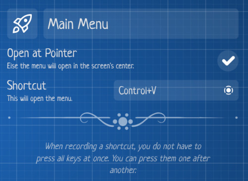
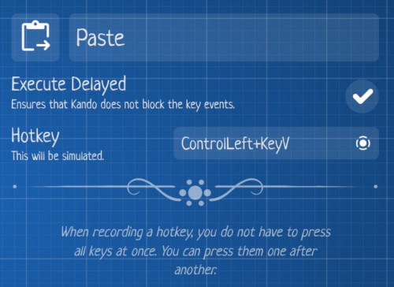

<!--
SPDX-FileCopyrightText: Simon Schneegans <code@simonschneegans.de>
SPDX-License-Identifier: CC-BY-4.0
-->

</img>

# Configuring Kando

Kando comes with a graphical menu editor which allows you to create and edit your own menus.
All configuration is stored JSON files which you can also edit manually.

## The Menu Editor

</img>

There are three ways to open the menu editor:
1. **When a menu is shown:** Click the gear icon in the bottom right corner of the screen.
2. **From the system tray:** Right-click the Kando icon and select "Show Settings".
3. **From the command line:** Run `kando --settings`.

## The Configuration Files

For now, Kando uses **two configuration files**. `config.json` stores the general configuration of the application and `menus.json` stores the configuration of the individual menus.
Depending on your platform, the configuration files are located in different directories:

*  Windows: `%appdata%\kando\`
*  macOS: `~/Library/Application Support/Kando/`
*  Linux: `~/.config/kando/`

**📝 JSON Format**: Both configuration files are JSON files. You can edit them with any text editor.

**🔥 Hot Reloading:** Whenever you save a file, Kando will automatically reload the configuration.

**✅ Validation:** Kando will validate the configuration files and [print errors to the console](installing.md#running-kando-from-the-command-line) if it finds any. In this case, the configuration will not be reloaded. If a configuration file is invalid at startup, Kando will use the default configuration instead.


### The General Configuration: `config.json`

This file contains the general configuration of Kando.
For now, only a single option is available:

Property | Default Value | Description
-------- | ------------- | -----------
`sidebarVisible` | `true` | Whether the left sidebar is currently visible.

### The Menu Configuration: `menus.json`

This file contains the configuration of the individual menus.
There are two top-level JSON objects: `menus` contains a list of _Menu Descriptions_ and `stash` contains a list of currently stashed menu items as _Menu Item Descriptions_.

```js
{
  "menus": [
    {
      // First Menu Description.
      // ...
    },
    {
      // Second Menu Description.
      // ...
    },
    // ...
  ],
  "stash": [
    // Currently stashed Menu Items.
  ]
}
```

> [!TIP]
> You can have a look at a complete example configuration [here](https://gist.github.com/Schneegans/ebd385030bb7e15aa24d73f23abb4b53)!


#### Menu Descriptions

The items in the `menus` list are called menu descriptions.
They are JSON objects with the following properties:

Property | Default Value | Description
-------- | ------------- | -----------
`shortcut` | `""` | The shortcut which opens the menu. This is a string which can contain multiple keys separated by `+`. For example, `"Ctrl+Shift+K"` or `"Cmd+Shift+K"`. If empty, the menu will not have a shortcut. See [Menu Shortcuts vs. Simulated Hotkeys](#menu-shortcuts-vs-simulated-hotkeys) for details.
`shortcutID` | `""` | On some platforms, Kando can not bind shortcuts directly. In this case, you can use this property to assign an ID which can be used in the global shortcut configuration of your desktop environment. This should be lowercase and contain only ASCII characters and dashes. For example, `"main-trigger"`.
`nodes` | _mandatory_ | The root menu item of the menu given as a Menu Item Description. See below for details.
`centered` | `false` | Whether the menu should be centered on the screen. If this is `false`, the menu will be opened at the position of the mouse cursor.

#### Menu Item Descriptions

The layout of the menu is described by a tree of nodes.
Each menu item is a JSON object with the following properties:

Property | Default Value | Description
-------- | ------------- | -----------
`name` | `"undefined"` | The name of the menu item. This is shown in the center of the menu when the item is hovered. The name of the root item defines the name of the menu.
`iconTheme` | `""` | For now, this can either be `"material-symbols-rounded"`, `"simple-icons"`, `"simple-icons-colored"`, or `"emoji"`. With the first, you can use icons from [Google's Material Symbols](https://fonts.google.com/icons). With the second or third, you can use any icon from [Simple Icons](https://simpleicons.org/).
`icon` | `""` | The name of the icon from the given icon theme or an emoji like `"🚀"`.
`angle` | _auto_ | If given, this defines the angle of the menu item in degrees. If this is not given, the angle is calculated automatically. 0° means that the item is at the top of the menu, 90° means that the item is on the right side of the menu, and so on. All sibling nodes are evenly distributed around the nodes with given angles.
`type` | `"submenu"` | The type of the menu item. There are several types available. See below for details.
`data` | `{}` | Depending on the type of the item, this can contain additional data. See below for details.
`children` | `[]` | If the menu item is a submenu, this contains a list of child nodes. See below for details.

#### Menu Item Types

For now, the `type` property of a menu item can be one of the following values.
New types will be added in the future.

**`"submenu"`:** This is the default type. It is used to create a submenu. The `children` property of the menu item must contain a list of child nodes.

**`"command"`:** This type is used to execute a shell command. The `data` property of the menu item must contain a `command` property which contains the shell command to execute. For instance, this menu item will open Inkscape on Linux:
```json
{
  "name": "Inkscape",
  "icon": "inkscape",
  "iconTheme": "simple-icons",
  "type": "command",
  "data": {
    "command": "/usr/bin/inkscape"
  }
}
```

**`"uri"`:** This type is used to open any kind of URI. The `data` property of the menu item must contain a `uri` property which contains the URI to open. For instance, this menu item will open GitHub in the default browser:
```json
{
  "name": "GitHub",
  "icon": "github",
  "iconTheme": "simple-icons",
  "type": "uri",
  "data": {
    "uri": "https://github.com"
  }
}
```

**`"hotkey"`:** This type is used to simulate keyboard events. The `data` property of the menu item must contain a `hotkey` property which contains the hotkey to simulate. See [Menu Shortcuts vs. Simulated Hotkeys](#menu-shortcuts-vs-simulated-hotkeys) for details on the format of the `hotkey` property. The optional `delayed` property will ensure that the hotkey is simulated _after_ the Kando window is closed. This can be used if the hotkey should be captured by another window. For instance, this menu item will paste the clipboard content:
```json
{
  "name": "Paste",
  "icon": "content_paste_go",
  "iconTheme": "material-symbols-rounded",
  "type": "hotkey",
  "data": {
    "hotkey": "ControlLeft+KeyV",
    "delayed": true
  }
}
```

## Menu Shortcuts vs. Simulated Hotkeys

With Kando, you can bind a menu to a keyboard shortcut and use menu items to simulate keyboard hotkeys.
This is a bit confusing as both are configured similarly, but use different formats.

Below is the configuration of a menu bound to <kbd>Ctrl</kbd>+<kbd>V</kbd> and a menu item simulating <kbd>Ctrl</kbd>+<kbd>V</kbd>.
As you can see, the format for the key combination is different.

Menu-Shortcut Configuration | Hotkey-Item Configuration
--------------------------- | -------------------------
 | 

The reason for this is complex: Depending on the platform, Kando uses different mechanisms to bind menus to shortcuts.
All of these require _key names_ for the shortcuts.
The hotkey items on the other hand simulate _key codes_.
Each key on your keyboard has a unique _key code_.
The keyboard layout you have set in your OS assigns a _key name_ to each _key code_.
For instance, the key with the _code_ `KeyZ` gets the _name_ `Y` with a German keyboard layout.

### Valid Menu Shortcuts (using _key names_)

On most platforms, Kando uses the [Electron Accelerator](https://www.electronjs.org/docs/api/accelerator) format to bind shortcuts.
Hence, each shortcut may contain any number of modifiers and must end with a key name.
All names are case-insensitive and must be separated by `+`.

**Available Modifier Names:**
<kbd>Command</kbd>
<kbd>Cmd</kbd>
<kbd>Control</kbd>
<kbd>Ctrl</kbd>
<kbd>CommandOrControl</kbd>
<kbd>CmdOrCtrl</kbd>
<kbd>Alt</kbd>
<kbd>Option</kbd>
<kbd>AltGr</kbd>
<kbd>Shift</kbd>
<kbd>Super</kbd>
<kbd>Meta</kbd>

**Available Key Names:** <kbd>0</kbd>-<kbd>9</kbd>
<kbd>A</kbd>-<kbd>Z</kbd>
<kbd>F1</kbd>-<kbd>F24</kbd>
<kbd>)</kbd>
<kbd>!</kbd>
<kbd>@</kbd>
<kbd>#</kbd>
<kbd>$</kbd>
<kbd>%</kbd>
<kbd>^</kbd>
<kbd>&</kbd>
<kbd>*</kbd>
<kbd>(</kbd>
<kbd>:</kbd>
<kbd>;</kbd>
<kbd>'</kbd>
<kbd>+</kbd>
<kbd>=</kbd>
<kbd><</kbd>
<kbd>,</kbd>
<kbd>_</kbd>
<kbd>-</kbd>
<kbd>></kbd>
<kbd>.</kbd>
<kbd>?</kbd>
<kbd>/</kbd>
<kbd>~</kbd>
<kbd>`</kbd>
<kbd>{</kbd>
<kbd>]</kbd>
<kbd>[</kbd>
<kbd>|</kbd>
<kbd>\\</kbd>
<kbd>}</kbd>
<kbd>"</kbd>
<kbd>Plus</kbd>
<kbd>Space</kbd>
<kbd>Tab</kbd>
<kbd>Capslock</kbd>
<kbd>Numlock</kbd>
<kbd>Scrolllock</kbd>
<kbd>Backspace</kbd>
<kbd>Delete</kbd>
<kbd>Insert</kbd>
<kbd>Return</kbd>
<kbd>Enter</kbd>
<kbd>Up</kbd>
<kbd>Down</kbd>
<kbd>Left</kbd>
<kbd>Right</kbd>
<kbd>Home</kbd>
<kbd>End</kbd>
<kbd>PageUp</kbd>
<kbd>PageDown</kbd>
<kbd>Escape</kbd>
<kbd>Esc</kbd>
<kbd>VolumeUp</kbd>
<kbd>VolumeDown</kbd>
<kbd>VolumeMute</kbd>
<kbd>MediaNextTrack</kbd>
<kbd>MediaPreviousTrack</kbd>
<kbd>MediaStop</kbd>
<kbd>MediaPlayPause</kbd>
<kbd>PrintScreen</kbd>
<kbd>num0</kbd>-<kbd>num9</kbd>
<kbd>numdec</kbd>
<kbd>numadd</kbd>
<kbd>numsub</kbd>
<kbd>nummult</kbd>
<kbd>numdiv</kbd>

### Valid Simulated Hotkeys (using _key codes_)

The configuration of the hotkey items should also contain any number of modifier key codes followed by a single non-modifier key code, all separated by `+`.
Note that not all key codes are available on all platforms.

**Available Modifier Key Codes:** 
<kbd>AltLeft</kbd>
<kbd>AltRight</kbd>
<kbd>ControlLeft</kbd>
<kbd>ControlRight</kbd>
<kbd>MetaLeft</kbd>
<kbd>MetaRight</kbd>
<kbd>ShiftLeft</kbd>
<kbd>ShiftRight</kbd>

**Available Non-Modifier Key Codes:**
<kbd>Again</kbd>
<kbd>ArrowDown</kbd>
<kbd>ArrowLeft</kbd>
<kbd>ArrowRight</kbd>
<kbd>ArrowUp</kbd>
<kbd>AudioVolumeDown</kbd>
<kbd>AudioVolumeMute</kbd>
<kbd>AudioVolumeUp</kbd>
<kbd>Backquote</kbd>
<kbd>Backslash</kbd>
<kbd>Backspace</kbd>
<kbd>BracketLeft</kbd>
<kbd>BracketRight</kbd>
<kbd>BrowserBack</kbd>
<kbd>BrowserFavorites</kbd>
<kbd>BrowserForward</kbd>
<kbd>BrowserHome</kbd>
<kbd>BrowserRefresh</kbd>
<kbd>BrowserSearch</kbd>
<kbd>BrowserStop</kbd>
<kbd>CapsLock</kbd>
<kbd>Comma</kbd>
<kbd>ContextMenu</kbd>
<kbd>Convert</kbd>
<kbd>Copy</kbd>
<kbd>Cut</kbd>
<kbd>Delete</kbd>
<kbd>Digit0</kbd>-<kbd>Digit9</kbd>
<kbd>Eject</kbd>
<kbd>End</kbd>
<kbd>Enter</kbd>
<kbd>Equal</kbd>
<kbd>Escape</kbd>
<kbd>F1</kbd>-<kbd>F24</kbd>
<kbd>Find</kbd>
<kbd>Help</kbd>
<kbd>Home</kbd>
<kbd>Insert</kbd>
<kbd>IntlBackslash</kbd>
<kbd>IntlRo</kbd>
<kbd>IntlYen</kbd>
<kbd>KanaMode</kbd>
<kbd>KeyA</kbd>-<kbd>KeyZ</kbd>
<kbd>Lang1</kbd>-<kbd>Lang5</kbd>
<kbd>LaunchApp1</kbd>
<kbd>LaunchApp2</kbd>
<kbd>LaunchMail</kbd>
<kbd>MediaPlayPause</kbd>
<kbd>MediaSelect</kbd>
<kbd>MediaStop</kbd>
<kbd>MediaTrackNext</kbd>
<kbd>MediaTrackPrevious</kbd>
<kbd>Minus</kbd>
<kbd>NonConvert</kbd>
<kbd>NumLock</kbd>
<kbd>Numpad0</kbd>-<kbd>Numpad9</kbd>
<kbd>NumpadAdd</kbd>
<kbd>NumpadComma</kbd>
<kbd>NumpadDecimal</kbd>
<kbd>NumpadDivide</kbd>
<kbd>NumpadEnter</kbd>
<kbd>NumpadEqual</kbd>
<kbd>NumpadMultiply</kbd>
<kbd>NumpadParenLeft</kbd>
<kbd>NumpadParenRight</kbd>
<kbd>NumpadSubtract</kbd>
<kbd>Open</kbd>
<kbd>PageDown</kbd>
<kbd>PageUp</kbd>
<kbd>Paste</kbd>
<kbd>Pause</kbd>
<kbd>Period</kbd>
<kbd>Power</kbd>
<kbd>PrintScreen</kbd>
<kbd>Quote</kbd>
<kbd>ScrollLock</kbd>
<kbd>Select</kbd>
<kbd>Semicolon</kbd>
<kbd>Slash</kbd>
<kbd>Sleep</kbd>
<kbd>Space</kbd>
<kbd>Tab</kbd>
<kbd>Undo</kbd>
<kbd>WakeUp</kbd>

<p align="center"></p>

<p align="center">
  
  <a href="installing.md"> Building Kando</a>
  
  <a href="README.md"> Index</a>
  
  
  
</p>
