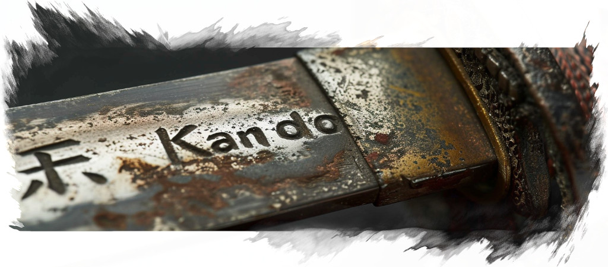

<!--
SPDX-FileCopyrightText: Simon Schneegans <code@simonschneegans.de>
SPDX-License-Identifier: CC-BY-4.0
-->

</img>

# Contributing to Kando

Whenever you encounter a :bug: **bug** or have :tada: **feature request**, 
report this as a [GitHub issue](https://github.com/kando-menu/kando/issues)!

We are happy to receive contributions in the form of **pull requests** on GitHub.
Feel free to fork the repository, implement your changes and create a merge request to the `main` branch!

## Branching Guidelines

Kando uses a simplified version of [GitFlow](https://nvie.com/posts/a-successful-git-branching-model/):
New features are usually implemented in `feature/*` branches and are merged to `main` once they are finished.
Similarly, bugfixes are implemented in `fix/*` branches, where the `*` is usually the issue number (e.g. `fix/#123`).

### Git Commit Messages

Commits should start with a Capital letter and should be written in imperative mood (e.g. __:tada: Add cool new feature__ instead of __:tada: Added cool new feature__).
It's a great idea to start the commit message with an applicable emoji.
This does not only look great but also makes you rethink what to add to a commit:
Commits should be small and focused on a single task.
Therefore, only one emoji should be used per commit.
* :tada: `:tada:` when adding a cool new feature.
* :bug: `:bug:` when fixing a bug.
* :wrench: `:wrench:` when adding or improving a small piece of code.
* :recycle: `:recycle:` when refactoring the code.
* :fire: `:fire:` when removing files or code.
* :truck: `:truck:` when moving / renaming files or classes.
* :sparkles: `:sparkles:` when formatting the code.
* :art: `:art:` improving or adding assets like themes or fonts.
* :lipstick: `:lipstick:` when working on the UI styling.
* :memo: `:memo:` when writing docs.
* :globe_with_meridians: `:globe_with_meridians:` when working on localization.
* :revolving_hearts: `:revolving_hearts:` when updating credits.
* :heavy_check_mark: `:heavy_check_mark:` when working on tests.
* :arrow_up_small: `:arrow_up_small:` when adding / upgrading dependencies.
* :arrow_down_small: `:arrow_down_small:` when removing / downgrading dependencies.
* :twisted_rightwards_arrows: `:twisted_rightwards_arrows:` when merging branches.

Usage of these emojis is not mandatory; we will still accept your pull request if you don't use them.
However, we will be very happy if you do :smile:.

## Versioning

Kando uses [semantic versioning](https://semver.org) and the [changelog](changelog.md) follows the rules of [Keep a Changelog](http://keepachangelog.com/).
Whenever you add a new feature or fix a bug, please add an entry to the top of the changelog in the `[unreleased]` section.
When a new version is released, this section will be marked as released and a tag is created on the `main` branch.

## Continuous Integration

[Github Actions](https://github.com/kando-menu/kando/actions) are used for continuous integration.
* For **each commit**, several checks are performed. These include code formatting, linting, [REUSE](https://reuse.software/) compliance and unit tests.
* For **pull requests**, it is checked in addition that the application can be packaged for Linux and Windows.
* When a **new tag** is created, the application is packaged for Linux, macOS, and Windows and uploaded to the [releases page](https://github.com/kando-menu/kando/releases).

  
  <a href="changelog.md"> Changelog</a>
  
  <a href="README.md"> Index</a>
  
  <a href="installing.md">Building Kando </a>

