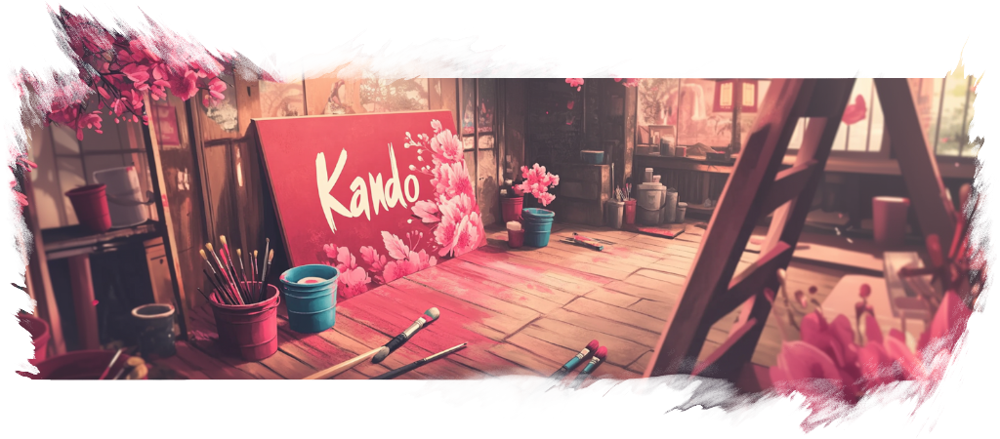

<!--
SPDX-FileCopyrightText: Simon Schneegans <code@simonschneegans.de>
SPDX-License-Identifier: CC-BY-4.0
-->

</img>

# Creating Menu Themes for Kando

Kando allows you to create custom themes for the menus.
A theme defines several layers which will be painted on top of each other for each menu item.
Depending on the menu item's state (e.g. active, child, parent, hovered, etc.), the layers can be styled differently using [CSS](https://www.w3schools.com/css/).

## 🧬 Anatomy of a Menu Theme

A menu theme is a directory containing at least two files: `theme.json` and `theme.css`.
* The JSON file contains metadata about the theme and a list of layers which will be created for each menu item.
Each layer gets a specific _class name_ which can be used in the CSS file to style the layer.
* The CSS file can contain any CSS code you like. With _CSS selectors_, you can choose which layers to style in which way.

The CSS file can reference assets like images or fonts. These can be placed in the same directory as the JSON and CSS files or in a subdirectory.

## 📁 Menu Theme Locations

Depending on how you installed Kando, menu themes will be searched for in different locations.
First, Kando will look for menu-theme directories in your home directory:
*  Windows: `%appdata%\kando\menu-themes\`
*  macOS: `~/Library/Application Support/kando/menu-themes/`
*  Linux: `~/.config/kando/menu-themes/`

Next, Kando will look for menu-theme directories in the installation directory.
For this, look for the `resources/app/.webpack/renderer/assets/menu-themes/` directory in the installation directory.

If you are running Kando from the source code via `npm start`, it will look for themes in the `assets/menu-themes/` directory.

## 📑 Metadata and Layer Description: `theme.json`

> [!TIP]
> You can also name this file `theme.json5` and use the [JSON5](https://json5.org/) format. This is a bit easier to read and allows comments.

Below you can have a look at the `theme.json5` file of the default theme.
The keys are explained with inline comments.
Most of it will be clear, but some keys might need a bit more explanation.
We will have a look at the `colors` and `layers` keys in the following sections.

https://github.com/kando-menu/kando/blob/235e29c9d558d554b83b401fbb61fbf74a65f034/assets/menu-themes/default/theme.json5#L1-L39

### `colors: {}`

The `colors` object lists colors which can be configured by the user.
Each entry maps a CSS color to a given color name.
In your CSS file, you can use the colors with `var(--<key>)`.
In the menu editor, the user can change the value of these colors.

### `layers: []`

This is maybe the most important part of the metadata file.
It describes the div elements which will be created for each menu item.
The layer will be **drawn top-to-bottom** in the order they are defined in the JSON file.
So the first layer will be the topmost layer, and the last layer will be the bottommost layer.

Each layer has a `class` and a `content` key.
The `class` key is used in the CSS file to style the corresponding div element.
The value for the `content` key is a string.
For now, these content strings are limited to the following values:

Content Type | Description
--- | ---
`content: "none"` | The layer will be empty. This is for instance useful for simple background layers. You can also assign a background-image to the layer in the CSS file.
`content: "icon"` | The layer will contain a nested `.icon-container` element for this menu item. For a simple theme, a single layer of this type is usually enough, as you can style the layer to have a background color, border, drop shadow, etc.
`content: "name"` | The text content of the layer element will be the name of the menu item.

You can use the **same content type multiple times** in the `layers` array.
For instance, it is perfectly fine to have multiple layers with `content: "icon"`.
This could be useful if you want to add a glow effect to the icon: There's one layer with the icon and another layer below with a blurred version of the icon.

However, keep in mind that the menu rendering performance will generally be better if you use fewer layers.


## 🎨 Styling of the Menu: `theme.css`

Kando assigns a CSS class name to each menu-item element based on the current state of the menu item (child, center, parent, hovered, etc).
The overall tree structure of the menu may look like this:

```
#kando-menu
├ .menu-node.level-0.top.type-submenu.parent                    <-- This is the root item of the menu.
│  ├ .menu-node.level-1.top.type-submenu.grandchild                 It has three children, the third one
│  │  ├ .menu-node.level-2.right.type-uri                           is a submenu which is currently open.
│  │  └ .menu-node.level-2.left.type-command
│  ├ .menu-node.level-1.right.type-submenu.grandchild
│  │  ├ .menu-node.level-2.top.type-hotkey
│  │  └ .menu-node.level-2.bottom.type-macro
│  └ .menu-node.level-1.left.type-submenu.active                <-- This is the currently active menu item.
│     ├ .menu-node.level-2.child.top.type-uri                       It has four children.
│     ├ .menu-node.level-2.type-submenu.child.hovered.dragged   <-- The second child is a submenu which is
│     │  ├ .menu-node.level-3.grandchild.top.type-command           currently dragged around in marking or
│     │  └ .menu-node.level-3.grandchild.bottom.type-command        turbo mode.
│     ├ .menu-node.level-2.child.left.type-submenu
│     │  ├ .menu-node.level-3.grandchild.top.type-command
│     │  └ .menu-node.level-3.grandchild.bottom.type-command
│     └ .menu-node.level-2.child.right.type-macro
└ .center-text                                                  <-- This is the text shown in the center
                                                                    of the menu.
```

In this example, the menu container contains two elements: The center text and the root item of the menu.
The center text shows the name of the currently selected item.
It is automatically moved to the currently active menu item.
In the above case, the root item contains three submenus.
The third child is a submenu which is currently open (`.active`).
Therefore the root item is a `.parent` and the other two children are drawn as `.grandchild`.
The `.active` child has four children itself, two of which have grandchildren.
The second child is currently `.dragged` in marking mode.
It also is `.hovered` by the mouse cursor.

In addition, each menu node has a **class for the current level** (`.level-0`, `.level-1`, `.level-2`, etc).
This can be used to style the menu items differently depending on their depth in the menu tree.
Only the root item has the class `.level-0`.

Furthermore, the **menu node classes contain the type of the item** (`.type-submenu`, `.type-uri`, `.type-command`, etc).
This can be used to style different item types differently.

Last but not least, **each menu node has a class for its approximate direction** relative to the center of the menu (`.top`, `.right`, `.bottom`, `.left`). Escept for the root node, which is always in the center.

Not depicted in the tree structure above are **the connector lines** between the menu items and the layers added by the theme.
The connector lines are long divs which are appended to each submenu menu node.
They have the class `.connector` and can be styled as well.

> [!TIP]
> In the "Development" tab of the sidebar, you can find a button to open the inspector. You can use them to explore the structure of the menu and find out how the layers are created.

### Custom CSS Properties

In addition to the colors specified in the theme's JSON file, Kando sets some custom CSS properties on some `.menu-node` and layer div elements.

Property | Available on | Description
--- | --- | ---
`--dir-x` | All elements with the `.menu-node` class except for the root node. | The x-direction of the menu item relative to the parent menu item. If the item is on the right side, this will be `1`, if it's on the left, it will be `-1`.
`--dir-y` | All elements with the `.menu-node` class except for the root node. | The y-direction of the menu item relative to the parent menu item. If the item is on the top, this will be `-1`, if it's on the bottom, it will be `1`.
`--angle` | All elements with the `.menu-node` class except for the root node. | The angle of the item in degrees, starting at the top with 0° and going clockwise.
`--parent-angle` | All elements with the `.menu-node` class except for the root node and the direct children of the root node. | The angle of the parent item relative to its parent in degrees, starting at the top with 0° and going clockwise. This is useful for styling grandchildren as this will be the same as the `--angle` property of the child.
`--angle-diff` | All elements with the classes `.menu-node.child`. | The angular difference between the item and the direction towards the mouse pointer.
`--pointer-angle` | All layer divs attached to the element with the `.menu-node.active` classes. | The angle towards the mouse pointer in degrees, starting at the top with 0° and going clockwise.
`--hover-angle` | All layer divs attached to the element with the `.menu-node.active` classes. | The angle towards the currently hovered item in degrees, starting at the top with 0° and going clockwise. If the center is hovered, this will be the direction towards the parent item (if there is any).
`--hovered-child-angle` | All layer divs attached to the element with the `.menu-node.active` classes. | The same as `--hover-angle`, but if the center is hovered, this will not be updated.
`--sibling-count` | All elements with the `.menu-node` class except for the root node. | The number of child items the item's parent has. This can be used to increase the child item distance if there are many children.


### Styling the Layers

You can now use [CSS selectors](https://www.w3schools.com/css/css_selectors.asp) to style each of these elements.
Usually, you will want to apply a transformation to the `.menu-node` elements to position them correctly on their position around the center.
Appearance properties like `background-color`, `border`, `box-shadow`, or `filter` are usually applied to the layer elements.
Here's how the theme.css file of the default theme looks like:

https://github.com/kando-menu/kando/blob/235e29c9d558d554b83b401fbb61fbf74a65f034/assets/menu-themes/default/theme.css#L1-L177

You should have a look at this default theme to get an idea of how to style the menu.
It is maybe a good idea to start with a copy of the default theme and modify it to your needs.
You can also have a look at the other included themes for inspiration, most of them use more than one layer.

> [!TIP]
> In the "Development" tab of the sidebar, you can find a "Reload Menu Theme" button. You can use this button during theme development to reload the theme without restarting Kando. Changes you made to the CSS file will be applied immediately, for changes to the JSON file you need to re-open the menu. If you are running Kando from the source code via `npm start`, any changes made to the themes in the `assets/menu-themes/` directory will be applied immediately.

### Useful CSS Selectors

Here are some CSS selectors which you may find useful.

```css
/* The center item if it has a hovered child. */
.menu-node.active:has(>.hovered) {}

/* A child of the center item if it or any of its siblings are hovered. */
.menu-node.active:has(.hovered)>.child {}

/* Menu nodes with a specific name. */
.menu-node[data-name='Menu Item Name'] {}
```

## 🛳️ Distributing your Theme

In the future, we plan to add a repository for sharing themes.
For now, you are invited to share your themes in [Kando's Discord Server](https://discord.gg/hZwbVSDkhy).
If the community likes your theme, we can even make it a default theme in Kando!

<p align="center"></p>

<p align="center">
  
  <a href="config-files.md"> Config Files</a>
  
  <a href="README.md"> Index</a>
  
  
  
</p>